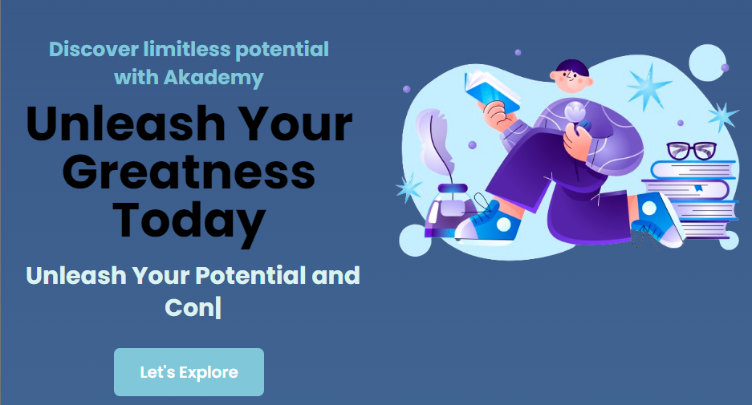
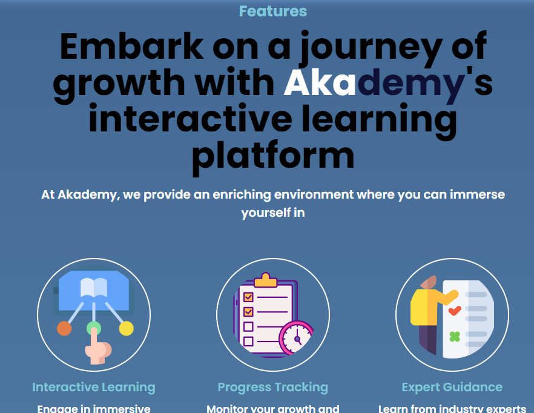
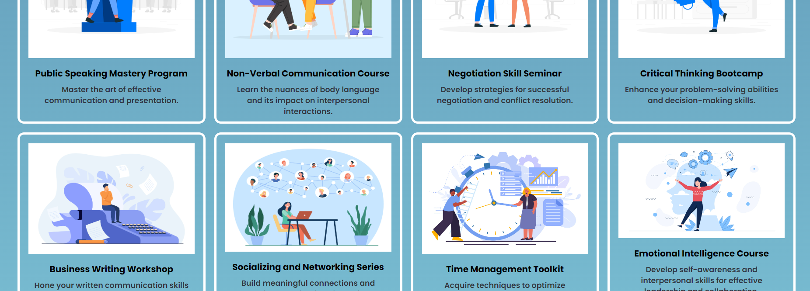
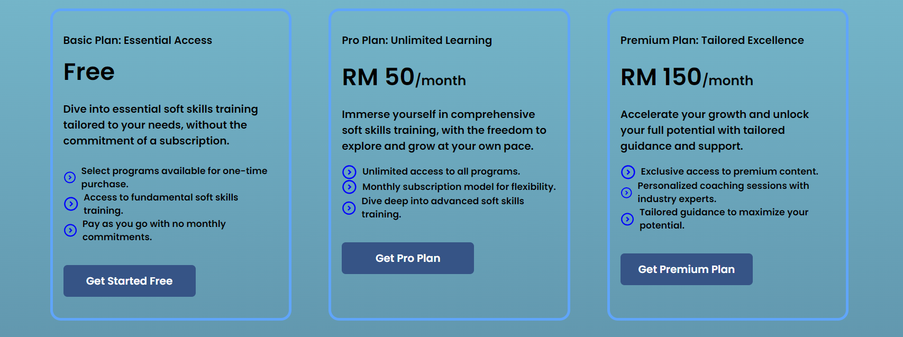
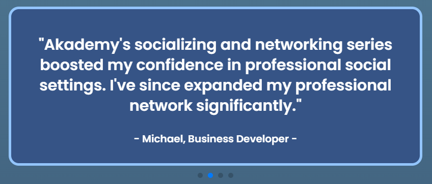
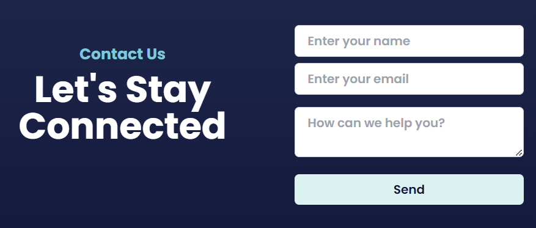

# Akademy Landing Page Documentation
This is a documentation for the Akademy landing page. Its will provides an overview of the structure, components and styles that used in building this landing page.

### Table of Contents
1. Introduction
2. Components
   - Hero Section
   - Features Section
   - Products/Services Section
   - Pricing Section
   - Testimonials Section
   - Contact Section
3. Styling
4. Customization
5. Copyright & Attribution

## 1. Introduction
The Akademy landing page is a minimalist page designed to showcase Akademy's online education and encourage visitors to sign up for learning programs. It aims to highlight the key features and benefits of Akademy'service while providing appealing and user-friendly inteface.

## 2. Components
### Hero Section
This section is the first section users see when they visit landing page.
It includes a prominent heading, a brief description of Akademy's offerings and call-to-action button to encourage users to explore more.

### Features Section
This section highlights the key features and benefits of Akademy's services. It include a list of features with descriptive icons to visually represent each feature.

### Products/ Services Section
This section showcase tha available learning programs offered by Akademy. It includes a list of products with desriptions to help users choose the most suitable program for their needs.

### Pricing Section
This section outlines the diffrent choices of pricing available for Akademy's learning programs. It includes details of each plans such as features and pricing to assist users in making descisions.

### Testimonials Section
This section display feedback and testimonials from satisfied learners who have benefited from Akademy's services.

### Contact section
This section provides users a way to get in touch with Akademy for inquires, support or assistance. 

## 3. Styling
1. Color Palette
- Akademy platform utilizes a carefully selected color palette to convey meaning, create visual hierarchy, and evoke emotion.
- Examples: Primary colors for branding, secondary colors for accents, and neutral colors for text.

2. Typography
- Typography plays a crucial role in the visual identity of the Akademy platform, with carefully chosen fonts for readability and aesthetics.
- Examples: Poppins and sans-serif used for headings, body text and appropriate font sizes for different sizes.

3. Layout
- The layout of the Akademy platform is designed to optimize usability and readability across various devices and screen sizes.
- Examples: Responsive layout with flexible grids, consistent spacing, and clear visual hierarchy.

## 4. Customization
The Akademy landing page can be customized to suit specific branding and design preferences. Customization options include:

- Color Scheme: Update the color scheme to align with brand guidelines.
- Typography: Customize fonts and typography styles for headings    paragraphs, and other elements.
- Content: Modify content, such as text, images, and testimonials, to reflect the unique offerings of Akademy.
- Layout: Adjust the layout and arrangement of sections to optimize user experience and visual appeal.
- Components: Extend or modify existing components or create new ones to add additional functionality or features.

## 5. Copyright & Attribution
1. Ilustration in hero section:
   -<a href="https://www.freepik.com/free-vector/gradient-poetry-illustration_23309611.htm#page=3&position=22&from_view=search&track=ais&uuid=37789113-2e18-465e-b1eb-363fd210eb4e">Image by pikisuperstar</a> on Freepik
   
2. Icon in feature section:
   - https://www.freepik.com/icon/guidance_4489706
   - <a href="https://www.flaticon.com/free-icons/lifetime" title="lifetime icons">Lifetime icons created by gungyoga04 - Flaticon</a>
   - https://www.freepik.com/icon/schedule_3339188
   - <a href="https://www.flaticon.com/free-icons/progress" title="progress icons">Progress icons created by Flat Icons - Flaticon</a>
   - <a href="https://www.flaticon.com/free-icons/help" title="help icons">Help icons created by Freepik - Flaticon</a>
   - https://www.freepik.com/icon/mind-map_6911554
   - https://www.freepik.com/icon/interactive_3048664
  
   
3. Illustration in service section:
    - <a href="https://www.freepik.com/free-vector/conference-speaker-concept-illustration_8691156.htm">Image by storyset</a> on Freepik
   - <a href="https://www.freepik.com/free-vector/tiny-screenwriter-sitting-retro-typewriter-thinking-screenplay-while-paper-drafts-flying-around-author_12291308.htm">Image by pch.vector</a> on Freepik
   - <a href="https://www.freepik.com/free-vector/partnership-concept-illustration_14206137.htm">Image by storyset</a> on Freepik
   - Image by <a href="https://www.freepik.com/free-vector/hand-drawn-positive-working-environment-illustration_172779846.htm">Freepik</a>
   -<a href="https://www.freepik.com/free-vector/design-inspiration-concept-illustration_10801344.htm">Image by storyset</a> on Freepik
   -<a href="https://www.freepik.com/free-vector/happy-woman-chatting-with-friends-online_12291106.htm">Image by pch.vector</a> on Freepik
   - Image by <a href="https://www.freepik.com/free-vector/hand-drawn-time-management-concept_12063412.htm">Freepik</a>
   - <a href="https://www.freepik.com/free-vector/woman-standing-thinking-get-idea_20822856.htm#query=personality%20development&position=7&from_view=keyword&track=ais&uuid=4a807e19-f509-42d8-8414-5e9e7ebd4b8d">Image by jcomp</a> on Freepik
     
4. Illustration in CTA section
   - <a href="https://www.freepik.com/free-vector/knowledge-concept-illustration_9793214.htm">Image by storyset</a> on Freepik

